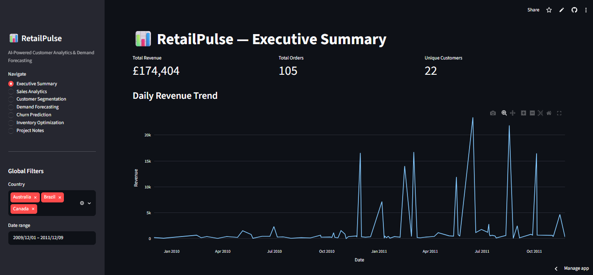
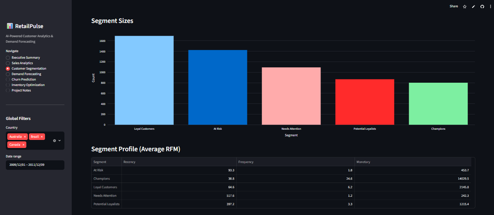
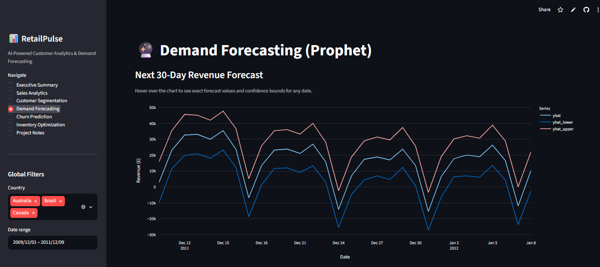
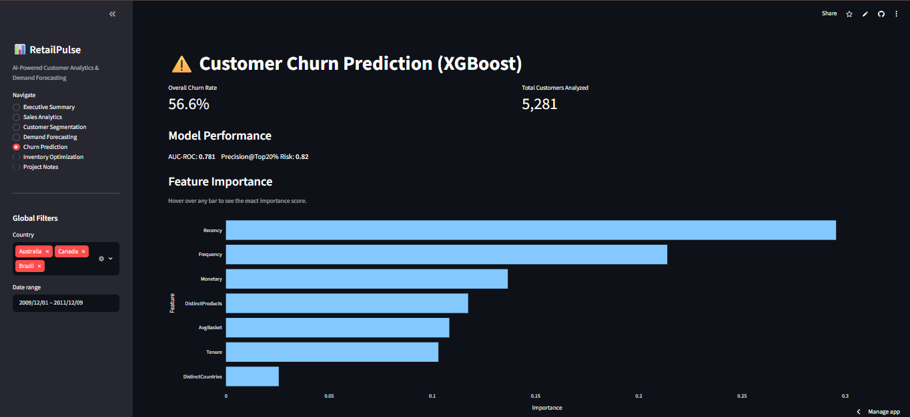

# RetailPulse — AI-Powered Customer Analytics & Demand Forecasting


An end-to-end data science pipeline built on the UCI Online Retail II dataset, covering customer segmentation, demand forecasting, churn prediction, and inventory optimization — delivered through an interactive Streamlit dashboard.

Built as a data science internship project for **Zidio Development**.

**🔗 Live Demo:** [retailpulse-xxxxxxxx.streamlit.app](https://retailpulse-xxxxxxxx.streamlit.app) *(replace with your actual URL)*
**👤 Author:** Hiren Raiyani ([@hraiyani-data](https://github.com/hraiyani-data))

---

## What This Project Does

| Module | Technique | Output |
|---|---|---|
| Customer Segmentation | RFM + KMeans clustering | 5 customer segments (Champions, Loyal, Potential Loyalists, At Risk, Needs Attention) |
| Demand Forecasting | Facebook Prophet | 30-day revenue forecast with confidence intervals |
| Churn Prediction | XGBoost classifier | Per-customer churn probability + risk ranking |
| Inventory Optimization | Safety stock formula | Reorder points and order quantities for top 50 SKUs |
| Dashboard | Streamlit + Plotly | 7-page interactive app tying all four models together |

---

## Architecture

```
                    ┌─────────────────────┐
                    │  Raw Data (UCI CSVs)│
                    └──────────┬──────────┘
                               ▼
                    ┌─────────────────────┐
                    │  data_pipeline.py    │  clean, dedupe, feature-engineer
                    └──────────┬──────────┘
                               ▼
                 ┌─────────────┼─────────────┬───────────────┐
                 ▼             ▼             ▼               ▼
        ┌───────────────┐ ┌──────────┐ ┌────────────┐ ┌──────────────┐
        │ segmentation.py│ │forecasting│ │churn_       │ │ inventory_   │
        │  RFM + KMeans │ │  .py      │ │prediction.py│ │optimization.py│
        │               │ │  Prophet  │ │  XGBoost    │ │ Safety stock │
        └───────┬───────┘ └─────┬─────┘ └──────┬─────┘ └───────┬──────┘
                 ▼               ▼               ▼               ▼
            ┌─────────────────────────────────────────────────────┐
            │        models/*.pkl  +  data/processed/*.csv         │
            └───────────────────────┬─────────────────────────────┘
                                     ▼
                        ┌─────────────────────────┐
                        │   dashboard/app.py       │
                        │   Streamlit + Plotly      │
                        │   (7-page interactive UI) │
                        └─────────────────────────┘
                                     ▼
                        ┌─────────────────────────┐
                        │  Streamlit Community      │
                        │  Cloud (live deployment)  │
                        └─────────────────────────┘
```

All four models run independently from `run_pipeline.py`, save their artifacts to `models/` and `data/processed/`, and the dashboard reads only pre-computed artifacts — it never retrains on page load.

---

## Dashboard Screenshots

> Replace the placeholders below with your own screenshots — save them into a `screenshots/` folder in the repo and update the paths.

| Executive Summary | Customer Segmentation |
|---|---|
|  |  |

| Demand Forecasting | Churn Prediction |
|---|---|
|  |  |

---

## Results (Honest, Backtest-Validated)

| Model | Metric | Result | Target | Status |
|---|---|---|---|---|
| Segmentation | Segments found | 5 | 6–8 | Below range |
| Forecasting | Backtest MAPE | 26.85% | ≤ 12% | Missed |
| Churn | AUC-ROC | 0.781 | ≥ 0.88 | Missed |
| Churn | Precision@Top20% risk | 0.82 | ≥ 0.75 | **Met ✅** |

Full discussion of these numbers, and the two real bugs found and fixed along the way, is in [`RetailPulse_Project_Report.pdf`](./RetailPulse_Project_Report.pdf).

---

## Business Impact

- **Retention targeting:** the At Risk segment (1,424 customers) and the top-20%-by-churn-probability list (82% precision) give a marketing team a concrete, ranked list to act on with a limited retention budget, instead of contacting the entire customer base.
- **Inventory planning:** reorder points and safety stock for the top 50 SKUs reduce the guesswork in monthly purchase orders, balancing stock-out risk against overstocking cost.
- **Revenue visibility:** a 30-day forecast with confidence bounds gives planning teams a range to budget against, rather than a single point guess.
- **Segment-aware strategy:** treating Champions, Loyal Customers, and At Risk customers differently (rather than one blanket campaign) is the standard lever RFM segmentation is built to support.

---

## Project Structure

```
RetailPulse/
├── data/
│   ├── raw/                  # UCI CSVs (not committed — see setup below)
│   └── processed/            # Cleaned data + model outputs
├── models/                   # Saved KMeans, Scaler, XGBoost model (.pkl)
├── notebooks/
│   └── RetailPulse_EDA_Walkthrough.ipynb
├── reports/
│   └── figures/               # All charts (EDA, elbow/silhouette, forecast, churn, etc.)
├── screenshots/                # Dashboard screenshots for this README
├── src/
│   ├── data_pipeline.py       # Load, clean, standardize raw data
│   ├── segmentation.py        # RFM + KMeans customer segmentation
│   ├── forecasting.py         # Prophet demand forecasting + backtesting
│   ├── churn_prediction.py    # XGBoost churn model (leakage-safe)
│   └── inventory_optimization.py  # Safety stock & reorder point calculation
├── dashboard/
│   └── app.py                 # Streamlit dashboard (7 pages, Plotly interactive charts)
├── run_pipeline.py             # Runs the entire pipeline end-to-end
├── requirements.txt
├── Dockerfile
└── RetailPulse_Project_Report.pdf
```

---

## Setup

**1. Clone the repo**
```bash
git clone https://github.com/hraiyani-data/RetailPulse.git
cd RetailPulse
```

**2. Create a virtual environment and install dependencies**
```bash
python -m venv venv
venv\Scripts\activate          # Windows
source venv/bin/activate       # macOS/Linux
pip install -r requirements.txt
```

**3. Download the dataset**
This repo does not include the raw CSVs (file size). Download the UCI Online Retail II dataset and place both year-range CSVs into `data/raw/`:
- Source: [UCI Machine Learning Repository — Online Retail II](https://archive.ics.uci.edu/dataset/502/online+retail+ii)

**4. Run the full pipeline**
```bash
python run_pipeline.py
```
This cleans the data, trains all four models, and saves every artifact to `data/processed/` and `models/`.

**5. Launch the dashboard**
```bash
streamlit run dashboard/app.py
```

**6. (Optional) Run with Docker**
```bash
docker build -t retailpulse .
docker run -p 8501:8501 retailpulse
```

---

## Methodology Highlights

**Segmentation** — Frequency and Monetary were log-transformed before scaling, since retail spend is heavily right-skewed and KMeans relies on Euclidean distance; without this, high-spending customers would dominate clustering. K=5 was chosen using Elbow + Silhouette analysis, not guessed.

**Forecasting** — Backtested on the last 30 real days rather than trusting the in-sample fit. A subtle bug was found here: Prophet generates continuous calendar dates, but this retailer has no Saturday transactions, which caused a row-position mismatch between forecast and actuals. Fixed by merging on the date column explicitly.

**Churn** — Features are computed only from transactions before a cutoff date; the churn label is computed from activity after that cutoff. This strict separation avoids data leakage — using full-dataset features to predict a full-dataset label would let the model implicitly see the future.

**Inventory** — Safety stock uses `Z(95%) × demand_std × √lead_time`. The square root reflects that demand uncertainty compounds over the lead-time window rather than growing linearly.

---

## Tech Stack

Python · pandas · scikit-learn · XGBoost · Prophet · Streamlit · Plotly · Docker

---

## Future Improvements

- Forecast per product category instead of one aggregate series, to reduce MAPE
- Optuna hyperparameter tuning for the churn model
- Full production stack: Airflow retraining, MLflow tracking, Evidently AI drift monitoring

---

## License

This project uses the UCI Online Retail II dataset for educational purposes as part of a data science internship.
